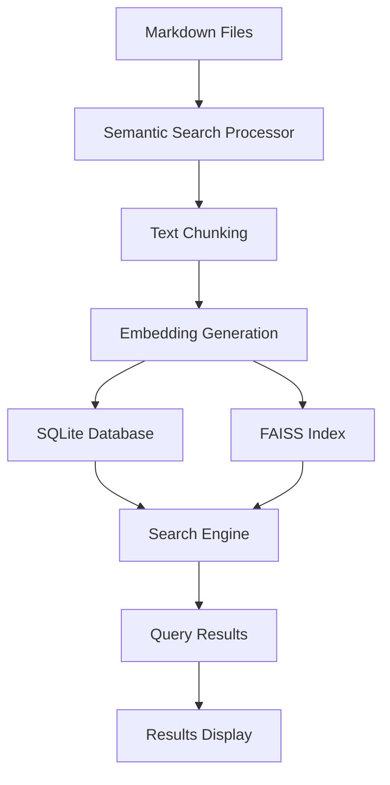

# MyNotes Architecture

## System Architecture Diagram

## Components

### Markdown Files
- Source documents stored as markdown files
- Processed for semantic search capabilities

### Semantic Search Processor
- Main component handling the search workflow
- Coordinates text processing and embedding generation

### Text Chunking
- Breaks markdown files into overlapping text chunks
- Preserves context between chunks for better search results

### Embedding Generation
- Uses `all-MiniLM-L6-v2` sentence transformer model
- Creates vector embeddings for semantic understanding

### SQLite Database
- Stores file metadata and chunk information
- Maintains document structure and relationships

### FAISS Index
- Stores vector embeddings for fast similarity search
- Provides efficient semantic search capabilities

### Search Engine
- Combines SQLite and FAISS data for comprehensive search
- Returns results ranked by semantic similarity

### Query Results
- Ranked search results with similarity scores
- Content previews and file metadata

### Results Display
- Frontend interface for presenting search results
- Interactive elements for exploring content
