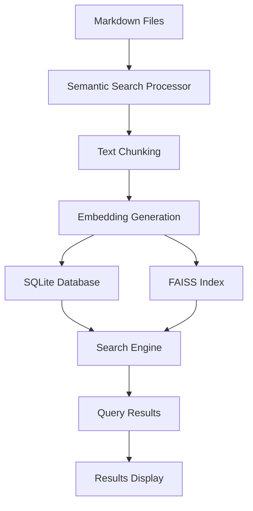

# MyNotes - Semantic Search of Markdown Files

A desktop application for semantic search of markdown files using SQLite vector database and FAISS.


## 🎯 Features

- **Semantic search capabilities** for markdown files
- **Smart content chunking** with overlapping text segments to preserve context
- **Vector embeddings** using `all-MiniLM-L6-v2` sentence transformer model for semantic understanding
- **Dual storage system** - SQLite for metadata and FAISS for fast similarity search
- **Desktop GUI** built with PyWebView and HTML, CSS, and JavaScript for the UI

## 🚀 Quick Start

### Prerequisites

- Python 3.7 or higher

### Installation

1. **Install dependencies with uv**
   ```bash
   uv sync
   ```

2. **Run the application**
   ```bash
   uv run python src/main.py
   # Or use the included run script:
   ./run.sh
   ```

## 🏗️ System Architecture



## 🛠️ Technical Details

### Core Components

#### 1. Semantic Search Processor
- Main component handling the search workflow
- Coordinates text processing and embedding generation
- Manages file change detection and incremental updates

#### 2. Text Chunking Engine
- Breaks markdown files into overlapping text chunks
- **Default chunk size**: 512 characters
- **Overlap**: 50 characters between chunks
- Preserves context between chunks for better search results

#### 3. Embedding Generation
- Uses `all-MiniLM-L6-v2` sentence transformer model
- Creates 384-dimensional vector embeddings
- Batch processing for efficiency
- L2 normalization for cosine similarity calculations

#### 4. SQLite Database
- Stores file metadata and chunk information
- Maintains document structure and relationships
- Indexed for fast metadata retrieval

#### 5. FAISS Index
- Stores vector embeddings for fast similarity search
- IndexFlatIP configuration for cosine similarity

#### 6. Search Engine
- Combines SQLite and FAISS data for comprehensive search
- Returns results ranked by semantic similarity
- Sub-100ms query performance for typical searches

## 🗄️ Database Design

### SQLite Database Schema

The application uses a SQLite database (`semantic_search.db`) to store metadata and chunk information:

#### Tables

1. **files** table:
   - `id` (INTEGER PRIMARY KEY AUTOINCREMENT)
   - `file_path` (TEXT UNIQUE NOT NULL)
   - `file_name` (TEXT NOT NULL)
   - `file_size` (INTEGER)
   - `modified_time` (REAL)
   - `content_hash` (TEXT)
   - `chunk_count` (INTEGER DEFAULT 0)
   - `created_at` (REAL)
   - `updated_at` (REAL)

2. **chunks** table:
   - `id` (INTEGER PRIMARY KEY AUTOINCREMENT)
   - `file_id` (INTEGER) - References files(id)
   - `chunk_index` (INTEGER)
   - `content` (TEXT NOT NULL)
   - `content_hash` (TEXT)
   - `faiss_id` (INTEGER UNIQUE) - Links to FAISS index position
   - `created_at` (REAL)

#### Table Relationships
- **One-to-many** relationship between `files` and `chunks`
- **Direct mapping** between `chunks` and FAISS vector positions via `faiss_id`

#### Performance Indexes
```sql
CREATE INDEX IF NOT EXISTS idx_files_path ON files(file_path);
CREATE INDEX IF NOT EXISTS idx_files_modified ON files(modified_time);
CREATE INDEX IF NOT EXISTS idx_chunks_file_id ON chunks(file_id);
CREATE INDEX IF NOT EXISTS idx_chunks_faiss_id ON chunks(faiss_id);
```

### How the Index Works

#### FAISS Index Configuration
- **Index type**: IndexFlatIP (Inner Product for normalized vectors = cosine similarity)
- **Dimension**: 384 (matches sentence transformer output)
- **Storage**: Binary file (`faiss_index.bin`) for persistence
- **Memory**: Loaded into RAM on startup for fast querying

#### Chunking Process
1. Files are split into overlapping chunks (512 characters with 50-character overlap)
2. Overlapping ensures context preservation between chunks
3. Each chunk is independently searchable and indexed
4. Chunk metadata allows precise content location within files

#### Search Workflow
1. **Query Processing**: User query processed through same embedding model
2. **Vector Search**: Query embeddings compared to FAISS index for similar content
3. **Metadata Retrieval**: SQLite database provides file information and chunk details
4. **Result Ranking**: Results sorted by semantic similarity score (cosine similarity)
5. **Response Formatting**: Content previews and metadata prepared for display

## 🔍 Semantic Search Features

### How It Works

The semantic search system:

1. **Processes markdown files** by breaking them into overlapping text chunks
2. **Generates embeddings** using the `all-MiniLM-L6-v2` sentence transformer model
3. **Stores metadata** in SQLite database (`semantic_search.db`)
4. **Indexes embeddings** in FAISS index (`faiss_index.bin`) for fast similarity search
5. **Provides semantic search** that finds content based on meaning, not just keywords

### Smart Content Chunking
- Files are split into overlapping chunks to preserve context
- Each chunk is independently searchable
- Results show which chunk matched and its position in the file
- Optimal chunk sizing for transformer model performance

### Similarity Scoring
- Results are ranked by semantic similarity (0-100%)
- Cosine similarity calculation between query and content vectors
- Higher scores indicate better semantic matches
- Typical relevance threshold: >0.3 for meaningful results

## ⚙️ Advanced Configuration

### Customizing Search Behavior

You can modify the semantic search behavior by editing `src/semantic_search.py`:

#### Chunking Strategies
```python
# For code documentation (smaller chunks for precision)
chunk_size=256, overlap=25

# For long-form content (larger chunks for context)
chunk_size=1024, overlap=100

# For mixed content (default balanced approach)
chunk_size=512, overlap=50
```

#### Model Selection
- **Change the model**: Modify `model_name` parameter for different embedding models
- **Adjust performance**: Balance between speed and accuracy based on your needs

### Model Information

#### Default Model: `all-MiniLM-L6-v2`
- **Embedding dimensions**: 384
- **Model size**: ~80MB download on first use
- **Performance**: Fast and efficient
- **Quality**: Good balance of speed and accuracy
- **Language**: Optimized for English text
- **Use case**: Suitable for most general-purpose scenarios

#### Alternative Models
For better quality (but slower performance):
- **`all-mpnet-base-v2`**: 768 dimensions, higher accuracy, ~420MB
- **`all-distilroberta-v1`**: Similar accuracy, faster inference
- **`all-MiniLM-L12-v2`**: Better accuracy than L6, ~120MB
- **`multi-qa-mpnet-base-dot-v1`**: 768 dimensions, optimized for Q&A scenarios

### Performance Tuning

#### Memory Optimization
- **Lazy initialization**: Semantic search loads only when first needed
- **Model caching**: Sentence transformer stays in memory once loaded
- **Index persistence**: FAISS index saved to disk, loaded on startup

#### Speed Optimization
- **Batch processing**: Multiple chunks encoded simultaneously
- **Change detection**: Skip unchanged files during index rebuilds
- **Indexed queries**: SQLite indexes on frequently queried columns
- **Vector normalization**: Pre-computed for fast cosine similarity

#### Storage Efficiency
- **Binary format**: FAISS uses optimized binary storage
- **Compressed embeddings**: 384 dimensions balance accuracy vs. storage
- **Incremental updates**: Process only changed files

### Troubleshooting

#### Common Issues

**Index Corruption**
- *Symptoms*: Search returns no results or application crashes
- *Solution*: 
  ```bash
  rm faiss_index.bin semantic_search.db
  python -m src.main  # Rebuild index from scratch
  ```
**Memory Issues**
- *Symptoms*: Application runs slowly or crashes on large datasets
- *Solutions*:
  - Reduce `top_k` parameter for searches (return fewer results)
  - Increase chunk size to reduce total number of chunks
  - Monitor system memory usage and close other applications

#### Performance Metrics
- **Index build time**: ~1-2 seconds per MB of markdown content
- **Query time**: <100ms for typical queries
- **Memory usage**: ~50MB base + ~1.5KB per chunk
- **Storage**: ~4KB per chunk (metadata + vector)
